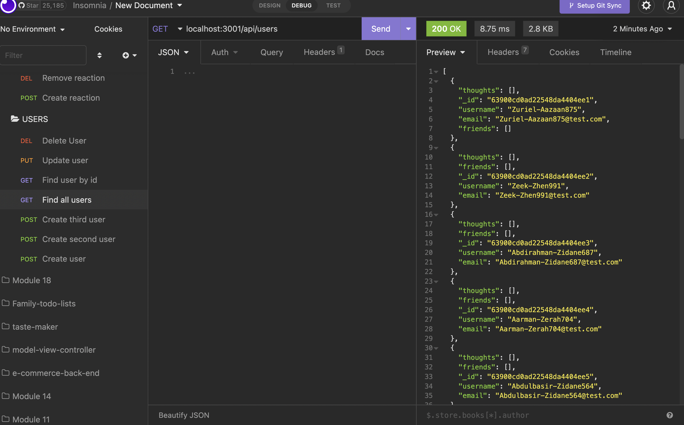
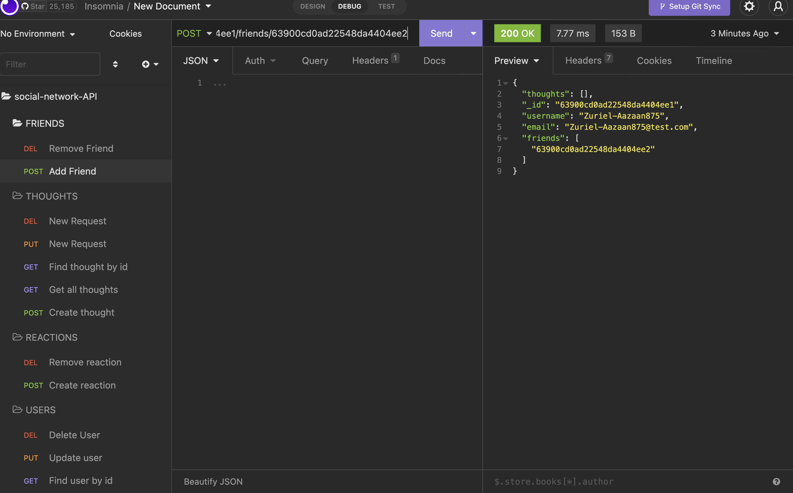
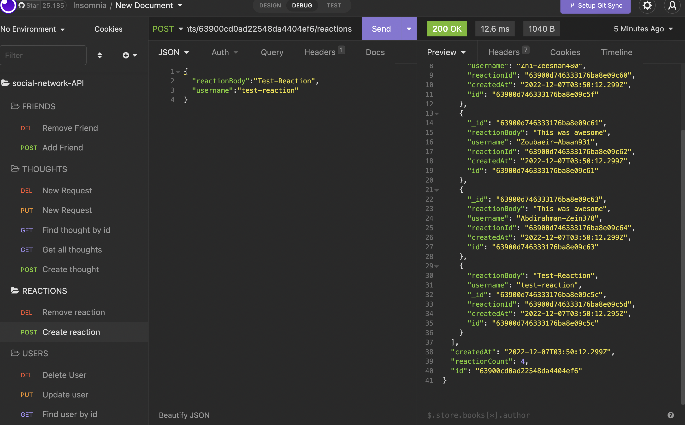

# Social Network API

<p> 
    
    
    
    
    
</p>


## Table of Contents
1. [Description](#description)
2. [User Story](#user-story)
3. [Screenshot](#screenshot)
4. [Video](#video)
5. [Installation](#installation)
6. [License](#license)
7. [Contributing](#contributing)
8. [Test](#test)
9. [Questions](#contact-information)

## Description
To build an API for a social network web application where users can share their thoughts, react to friends' thoughts, and create a friend list. The app will uses Express.js for routing, a MongoDB database, and the Mongoose ODM. 

## User Story
```md
AS A social media startup
I WANT an API for my social network that uses a NoSQL database
SO THAT my website can handle large amounts of unstructured data
```

## Screenshot








## Video
Check out the [walk-through video](https://drive.google.com/file/d/1clHnZijIo4UleTlDACSZyh2ulOsC25y_/view?usp=sharing).


## Installation
To clone the repo:
```
git clone https://github.com/shelldan/social-network-API.git
``` 
Run 'npm install' to install dependencies

Run 'npm seed' to plant the seed

Run 'npm start' to start the program

---

## License
[](https://opensource.org/licenses/MIT) 

## Contributing 
To contribute to this application, create a pull request.
Here are the steps needed for doing that:
- Fork the repo
- Create a feature branch (git checkout -b NAME-HERE)
- Commit your new feature (git commit -m 'Add some feature')
- Push your branch (git push)
- Create a new Pull Request

Following a code review, your feature will be merged.

---

## Test:
It is recommended that you follow this workflow: 

```
GIVEN a social network API
WHEN I enter the command to invoke the application
THEN my server is started and the Mongoose models are synced to the MongoDB database
WHEN I open API GET routes in Insomnia for users and thoughts
THEN the data for each of these routes is displayed in a formatted JSON
WHEN I test API POST, PUT, and DELETE routes in Insomnia
THEN I am able to successfully create, update, and delete users and thoughts in my database
WHEN I test API POST and DELETE routes in Insomnia
THEN I am able to successfully create and delete reactions to thoughts and add and remove friends to a user’s friend list
```

---

## Contact Information
* GitHub Username: [shelldan](https://github.com/shelldan)
